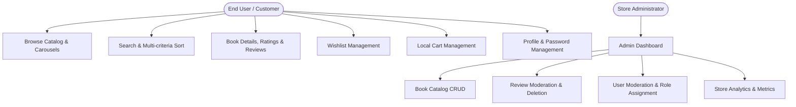
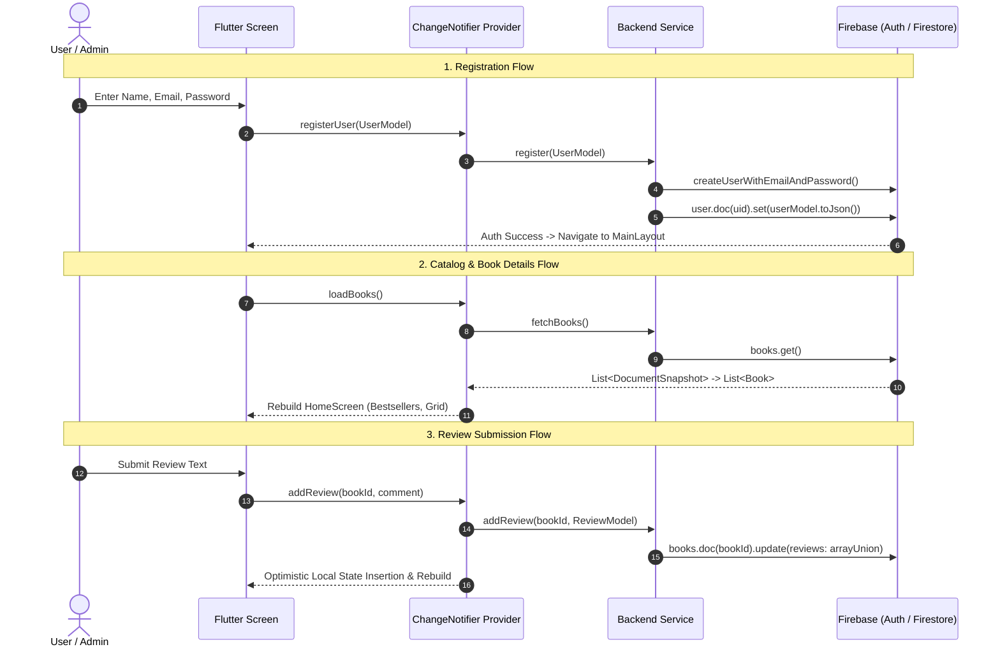
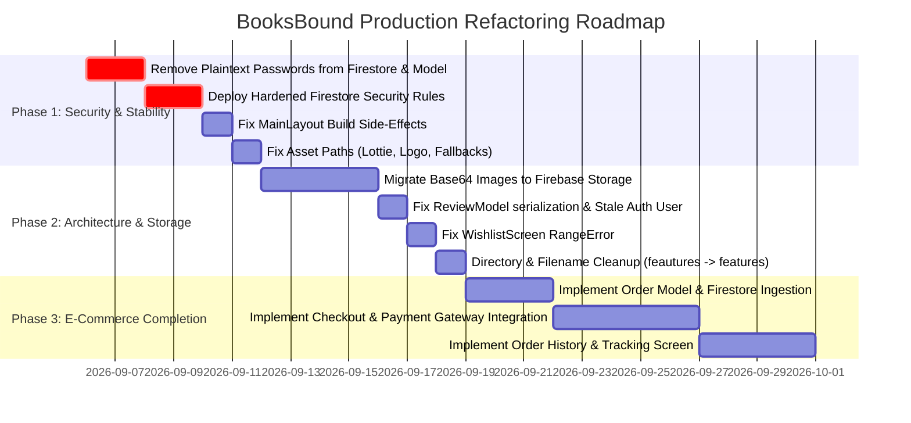

# BooksBound Codebase Architecture & Technical Audit

**Audit Date:** September 2026  
**Auditor:** Principal Flutter & Firebase Software Architect  
**Repository:** BooksBound Digital Bookstore (`booksbound_app`)  
**Target Platform:** Mobile (Android & iOS) / Web  

---

## Table of Contents
1. [Executive Summary](#1-executive-summary)
2. [Architecture & File Structure](#2-architecture--file-structure)
3. [Tech Stack & Dependencies](#3-tech-stack--dependencies)
4. [Firebase & Data Layer](#4-firebase--data-layer)
5. [Data Flow & Feature Walkthrough](#5-data-flow--feature-walkthrough)
6. [Technical Debt, Security Vulnerabilities & Immediate Recommendations](#6-technical-debt-security-vulnerabilities--immediate-recommendations)

---

## 1. Executive Summary

### 1.1 Core Purpose
**BooksBound** is a digital e-commerce bookstore mobile application developed with **Flutter** (Dart SDK `^3.9.2`) and powered by **Google Firebase** (Auth & Cloud Firestore). The application enables users to discover, search, rate, review, wishlist, and cart books, while providing store administrators with back-office capabilities to manage book listings, moderate reviews, oversee user accounts, and view platform business metrics.

### 1.2 Primary User Roles & Key Capabilities



#### A. End User (Customer)
* **Authentication**: Email/password registration and login with input validation.
* **Catalog Exploration**: View dynamic book carousels (Bestsellers, New Arrivals) and full grid view with custom rating badges.
* **Search & Filter**: Real-time client-side search by Title, Author, Genre, or ISBN; multi-criteria sorting (Price Low-to-High, Price High-to-Low, Newest Arrivals, Popularity).
* **Book Details & Social Feedback**: Detailed synopsis, interactive 1–5 star rating submission, community reviews listing, review posting, and review like/unlike toggling.
* **Wishlist**: Add/remove books to personal wishlist with real-time state synchronization.
* **Shopping Cart**: Add books, adjust quantities (increment/decrement), calculate subtotal/total price, and remove items (in-memory).
* **Account Management**: View profile details, update display name, update avatar from camera/gallery, and change account password via re-authentication.

#### B. Store Administrator
* **Role-Gated Access**: Restricted entry to the Admin Panel based on the `role: "admin"` flag in Firestore.
* **Book Management (CRUD)**: Create new book entries with cover upload, edit existing book metadata, and delete books with confirmation dialogs.
* **Review Moderation**: View all books, inspect all submitted reviews per book, and delete inappropriate reviews.
* **User Management**: Inspect registered users, toggle user blocking (`isBlocked`), and promote/demote user roles (`user` $\leftrightarrow$ `admin`).
* **Analytics Dashboard**: High-level store metrics displaying total users, blocked users, total books, bestseller counts, and total review counts.

---

## 2. Architecture & File Structure

### 2.1 Architectural Pattern
The codebase utilizes a **Hybrid Feature-First & Layered Architecture** with `ChangeNotifier` Providers for reactive state management. 

```
lib/
├── core/
│   └── theme/
│       └── app_theme.dart               # Global typography, color schemes & component themes
├── feautures/                           # [Typo in directory name: should be 'features']
│   ├── Auth/                            # Login & Registration screens
│   ├── admin/                           # Admin Panel & sub-features
│   │   ├── analytics/                   # Analytics screen, provider & service
│   │   ├── manageBooks/                 # Book CRUD screens
│   │   ├── manageReviews/               # Review moderation screens
│   │   └── manageUsers/                 # User management screen, provider & service
│   ├── bookDetails/                     # Single book view & review interface
│   ├── cart/                            # Cart checkout view
│   ├── changePassword/                  # Password update form
│   ├── editProfile/                     # Profile editing & avatar upload
│   ├── home/                            # Home dashboard with carousels & grid
│   ├── layout/                          # MainLayout with persistent bottom nav & app bar
│   ├── profile/                         # User profile view & action list
│   ├── search/                          # Search interface with live filtering
│   ├── splash/                          # Animated Lottie splash screen & auth router
│   └── wishlist/                        # User wishlist screen
├── models/                              # Data entity models (fromJson / toJson)
├── providers/                           # Global ChangeNotifier state containers
├── routes/                              # Centralized named routing definitions
├── services/                            # Firebase backend integration layer
├── widgets/                             # Shared/reusable UI components
├── firebase_options.dart                # Generated FlutterFire configuration
└── main.dart                            # Application entry point & MultiProvider setup
```

### 2.2 Component Breakdown

| Layer | Component Name | File Location | Responsibility |
| :--- | :--- | :--- | :--- |
| **Theme & Core** | `AppTheme` | `lib/core/theme/app_theme.dart` | Material 3 light theme, Poppins & Roboto text styles, button styles |
| **Routing** | `AppRoutes` | `lib/routes/app_routes.dart` | Static route names, declarative map, and `onGenerateRoute` factory |
| **Models** | `Book` | `lib/models/book_model.dart` | Book entity, Firestore `DocumentSnapshot` parser, `toMap` serializer |
| | `CartItem` | `lib/models/cart_item.dart` | Cart entity linking a `Book` and integer `quantity` |
| | `ReviewModel` | `lib/models/review_model.dart` | User review entity with timestamps and `likedBy` user ID list |
| | `UserModel` | `lib/models/user_model.dart` | User profile representation with roles, wishlist IDs, and ratings |
| **Services** | `AuthService` | `lib/services/auth_service.dart` | Firebase Auth integration (sign in, sign up, re-auth password change) |
| | `BooksService` | `lib/services/books_service.dart` | Firestore CRUD for `books` collection and Firestore search queries |
| | `ProfileService` | `lib/services/user_service.dart` | User profile fetching, name update, Base64 avatar upload |
| | `WishlistService` | `lib/services/wishlist_service.dart` | Firestore atomic array union/remove for wishlist IDs on user doc |
| | `RatingsService` | `lib/services/ratings_service.dart` | Subcollection `user/{uid}/ratings` writes and reads |
| | `ReviewsService` | `lib/services/reviews_service.dart` | Array manipulation for embedded reviews inside `books/{bookId}` |
| | `AdminUsersService` | `lib/feautures/admin/manageUsers/service/` | Admin queries to list users, toggle block status, and update roles |
| | `AdminAnalyticsService` | `lib/feautures/admin/analytics/services/` | Aggregated collection size queries for platform metrics |
| **Providers** | `BookProvider` | `lib/providers/book_provider.dart` | Book catalogue caching, in-memory search, sorting, and CRUD dispatch |
| | `UserAuthProvider` | `lib/providers/userauth_provider.dart` | Auth state controller (login, register, logout, password change) |
| | `CartProvider` | `lib/providers/cart_provider.dart` | In-memory shopping cart operations and total calculations |
| | `ProfileProvider` | `lib/providers/user_provider.dart` | Current user profile state, avatar, role loading (`isAdmin`) |
| | `WishlistProvider` | `lib/providers/wishlist_provider.dart` | Cached set of wishlisted book IDs with optimistic toggle |
| | `RatingsProvider` | `lib/providers/ratings_provider.dart` | User rating state for the active book |
| | `ReviewsProvider` | `lib/providers/reviews_provider.dart` | Reviews list state, user avatar caching, like toggling |
| | `AdminUsersProvider` | `lib/feautures/admin/manageUsers/provider/` | User list state for admin moderation |
| | `AdminAnalyticsProvider`| `lib/feautures/admin/analytics/provider/` | Metric counters state for admin dashboard |
| **Widgets** | `Brand` | `lib/widgets/brand.dart` | App brand header using `UncialAntiqua` font |
| | `AdminCard` | `lib/widgets/admin_card.dart` | Elevated dashboard navigation tile for Admin Panel |
| | `BookFormDialog` | `lib/widgets/book_form_dialog.dart` | Full modal form for adding/editing book details with image picker |
| | `buildRatingStars` | `lib/widgets/ratings.dart` | Reusable star generator (full, half, empty) for ratings |
| | `SortSheet` | `lib/widgets/sort_sheet.dart` | Bottom modal sheet for sorting books |

---

## 3. Tech Stack & Dependencies

### 3.1 State Management
The project exclusively uses **`provider: ^6.1.5+1`** with `MultiProvider` injected at the root in `main.dart`.
* State classes extend `ChangeNotifier` and notify subscribers via `notifyListeners()`.
* Consumption in UI uses `Consumer<T>`, `context.watch<T>()`, and `context.read<T>()`.

### 3.2 Core Dependencies Breakdown (`pubspec.yaml`)

```yaml
environment:
  sdk: ^3.9.2

dependencies:
  flutter:
    sdk: flutter
  provider: ^6.1.5+1                 # State management and DI container
  http: ^1.6.0                      # HTTP client (currently unutilized; Firebase SDK is used)
  lottie: ^3.3.2                    # Vector animation rendering for splash screen
  cupertino_icons: ^1.0.8           # iOS design icons
  persistent_bottom_nav_bar: ^6.2.1 # Multi-tab persistent navigation scaffolding
  firebase_core: ^4.4.0             # Core Firebase initialization bridge
  firebase_auth: ^6.1.4             # Firebase Authentication client
  cloud_firestore: ^6.1.2           # Cloud Firestore NoSQL database client
  image_picker: ^1.2.1              # Camera and Gallery image capture

dev_dependencies:
  flutter_test:
    sdk: flutter
  flutter_lints: ^5.0.0             # Standard Dart & Flutter static analysis rules
  flutter_launcher_icons: ^0.14.4   # Native app icon generator
```

### 3.3 Native Build & Platform Configuration

#### Android Configuration (`android/`)
* **Gradle Build Tool**: AGP `8.9.1` (`com.android.application`)
* **Gradle Distribution**: `gradle-9.1.0-all.zip`
* **Kotlin Version**: `2.1.0` (`org.jetbrains.kotlin.android`)
* **Google Services Plugin**: `4.3.15` (`com.google.gms.google-services`)
* **JVM & Java Compatibility**: `JavaVersion.VERSION_11` (source & target compatibility, `jvmTarget = "11"`)
* **Package / Namespace**: `com.example.e_project` (Default Flutter project template ID)
* **SDK Constraints**: `minSdk`, `targetSdk`, and `compileSdk` defer to Flutter SDK defaults.

---

## 4. Firebase & Data Layer

### 4.1 Firestore Schema & Document Structures

```
Firestore Root
├── books/ {bookId}
│   ├── title: string
│   ├── author: string
│   ├── genre: string
│   ├── description: string
│   ├── coverUrl: string (Base64 data or HTTP URL)
│   ├── price: number (double)
│   ├── rating: number (double)
│   ├── isBestseller: boolean
│   ├── releaseDate: timestamp
│   ├── isbn: string
│   └── reviews: array [
│         {
│           userId: string,
│           userName: string,
│           comment: string,
│           createdAt: string (ISO8601),
│           likedBy: array [string (userId)]
│         }
│       ]
│
└── user/ {userId}
    ├── uid: string
    ├── name: string
    ├── email: string
    ├── password: string (⚠️ WARNING: Raw plaintext password)
    ├── photoUrl: string (Base64 data)
    ├── createdAt: string (ISO8601)
    ├── role: string ("user" | "admin")
    ├── isBlocked: boolean
    ├── wishlist: array [string (bookId)]
    ├── ratings: map { bookId: number }
    └── [subcollection] ratings/ {bookId}
        ├── rating: number (double)
        └── updatedAt: timestamp
```

### 4.2 Authentication Methods
* **Configured**: Email & Password (`FirebaseAuth.instance.createUserWithEmailAndPassword`, `signInWithEmailAndPassword`).
* **OAuth Providers**: None implemented (no Google Sign-In, Apple Sign-In, etc.).

### 4.3 Security Rules Evaluation (`firestore.rules`)

```javascript
rules_version = '2';
service cloud.firestore {
  match /databases/{database}/documents {
    match /books/{document=**} {
      allow read: if true;
      allow write: if request.auth != null;
    }
    match /reviews/{document=**} {
      allow read: if true;
      allow write: if request.auth != null;
    }
    match /user/{document=**} {
      allow read, write: if request.auth != null;
    }
    match /cart/{document=**} {
      allow read, write: if request.auth != null;
    }
    match /wishlist/{document=**} {
      allow read, write: if request.auth != null;
    }
  }
}
```

#### Security Vulnerability Assessment:
1. **Unrestricted Admin Privileges on `/books`**: Any logged-in customer (`request.auth != null`) can add, modify, or permanently delete books from the catalogue.
2. **Total Exposure of User Data on `/user`**: Any authenticated user can read and modify all documents in the `/user` collection. A malicious user can read other users' plain-text passwords, modify other profiles, unblock their own blocked account, or elevate their role to `"admin"`.
3. **Mismatched Rules for Reviews**: Rules specify `/reviews/{document=**}`, but reviews are actually stored as an embedded array inside `/books/{bookId}` documents.
4. **Missing Field Validation**: Rules contain zero data validation rules (data types, mandatory fields, string length constraints).

---

## 5. Data Flow & Feature Walkthrough

### 5.1 End-to-End Data Flow



### 5.2 Implementation Status Matrix

| Screen / Feature | Route Name | Implementation Status | Notes / Limitations |
| :--- | :--- | :--- | :--- |
| **Splash Screen** | `/` | ⚠️ **Functional with Asset Bug** | Uses Lottie; asset path mismatch (`lottie/books.json` vs `assets/lottie/Books.json`). |
| **Login Screen** | `/login` | ✅ **Fully Built** | Form validation, password masking toggle, error handling. |
| **Register Screen** | `/register` | ✅ **Fully Built** | Name, email regex validation, confirm password matching. |
| **Main Layout** | `/main` | ⚠️ **Functional with Perf Bug** | Persistent bottom tabs; calls `provider.loadRole()` inside `build` method. |
| **Home Screen** | Tab 0 | ✅ **Fully Built** | Bestsellers carousel, New Arrivals carousel, full grid with sort trigger. |
| **Search Screen** | Tab 1 | ✅ **Fully Built** | Real-time client-side search across Title, Author, Genre, and ISBN. |
| **Cart Screen** | Tab 2 | ⚠️ **Partially Implemented** | Quantity adjustment and totals work; **Checkout button is a no-op placeholder**. |
| **Profile Screen** | Tab 3 | ✅ **Fully Built** | Avatar display, gallery image upload, routing to edit/password/logout. |
| **Book Details** | `/book/book-details`| ✅ **Fully Built** | Star ratings, wishlist toggle, review submission, review like counter. |
| **Wishlist Screen**| `/wishlist` | ⚠️ **Functional with Index Bug** | Reads user wishlist; filters `visibleBooks` inside `itemBuilder` (risk of RangeError). |
| **Edit Profile** | `/profile/edit-profile`| ✅ **Fully Built** | Updates user name and profile picture in Firestore. |
| **Change Password**| `/profile/change-password`| ✅ **Fully Built** | Uses `EmailAuthProvider.reauthenticateWithCredential` and `updatePassword`. |
| **Admin Panel** | `/admin-panel` | ✅ **Fully Built** | Role-guarded dashboard routing to management sub-screens. |
| **Manage Books** | `/admin-panel/manage-books` | ✅ **Fully Built** | Full CRUD modal dialogs (`BookFormDialog`) with Base64 image upload. |
| **Review Moderation**| `/admin-panel/manage-reviews-books` | ✅ **Fully Built** | Book picker and per-book review deletion. |
| **Manage Users** | `/admin-panel/manage-users` | ✅ **Fully Built** | User listing, toggle block, promote to admin, demote to user. |
| **Admin Analytics**| `/admin-panel/analytics` | ✅ **Fully Built** | Stat cards for total users, blocked users, books, bestsellers, reviews. |
| **Orders / Checkout**| N/A | ❌ **Not Implemented** | No order placement, order history, payment integration, or shipping info. |

---

## 6. Technical Debt, Security Vulnerabilities & Immediate Recommendations

### 6.1 Critical Severity (Must Fix Before Production)

```
+---------------------------------------------------------------------------------------+
|                               CRITICAL VULNERABILITIES                                |
+---+----------------------------------------------------+------------------------------+
| # | Issue Description                                  | Affected Components          |
+---+----------------------------------------------------+------------------------------+
| 1 | Plaintext Password Storage in Firestore            | UserModel, AuthService       |
| 2 | Permissive Firestore Rules (Any Auth User = Admin) | firestore.rules              |
| 3 | Base64 Image Storage inside Firestore Documents   | BooksService, ProfileService |
| 4 | State-Changing Operations in Widget Build Method   | MainLayout (layout.dart)     |
+---+----------------------------------------------------+------------------------------+
```

#### 1. Plaintext Passwords in Firestore
* **Vulnerability**: `AuthService.register()` writes the complete `UserModel.toJson()` to `user/{uid}`, which explicitly includes `'password': data.password`.
* **Impact**: Critical privacy and security violation. Anyone with database read access (or any authenticated user under current rules) can steal user passwords.
* **Fix**: Remove `password` from `UserModel.toJson()` and delete the field from the `user` Firestore schema entirely.

#### 2. Overly Permissive Firestore Security Rules
* **Vulnerability**: Rules grant full write permissions on `/books` and full read/write permissions on `/user` to any authenticated user.
* **Impact**: Any user can delete the book catalog, promote themselves to admin, or wipe out other user accounts.
* **Fix**: Implement role-based security rules:
  ```javascript
  rules_version = '2';
  service cloud.firestore {
    match /databases/{database}/documents {
      function isAdmin() {
        return request.auth != null && 
               get(/databases/$(database)/documents/user/$(request.auth.uid)).data.role == 'admin';
      }
      function isOwner(userId) {
        return request.auth != null && request.auth.uid == userId;
      }

      match /books/{bookId} {
        allow read: if true;
        allow write: if isAdmin();
      }

      match /user/{userId} {
        allow read: if isOwner(userId) || isAdmin();
        allow create: if request.auth != null && request.auth.uid == userId;
        allow update: if isOwner(userId) && (!request.resource.data.diff(resource.data).affectedKeys().hasAny(['role', 'isBlocked'])) || isAdmin();
        allow delete: if isAdmin();
        
        match /ratings/{bookId} {
          allow read, write: if isOwner(userId);
        }
      }
    }
  }
  ```

#### 3. Base64 Images in Document Fields
* **Vulnerability**: `_uploadBookImage()` and `changeProfilePicture()` convert camera/gallery images into raw Base64 strings and store them in Firestore string fields (`coverUrl`, `photoUrl`).
* **Impact**: Firestore has a **1 MB document limit**. A single high-res photo will cause document writes to fail. Additionally, fetching a book or user downloads megabytes of Base64 strings, resulting in extreme network bloat and high Firestore read costs.
* **Fix**: Integrate `firebase_storage`, upload image files to Cloud Storage buckets, and save the resulting public HTTPS download URLs in Firestore.

#### 4. State Modification in Widget `build()` Method
* **Vulnerability**: In `lib/feautures/layout/layout.dart` (lines 74–76):
  ```dart
  Consumer<ProfileProvider>(
    builder: (context, provider, _) {
      provider.loadRole(FirebaseAuth.instance.currentUser!.uid);
      ...
  ```
* **Impact**: Calling `provider.loadRole()` triggers `notifyListeners()` during the widget build phase, which violates Flutter framework invariants and causes rebuild loops, frame drops, or crashes.
* **Fix**: Move `loadRole()` to `initState()` or execute it post-login in `UserAuthProvider`.

---

### 6.2 High & Medium Severity (Bugs & Code Smells)

#### 5. Asset Path Formatting Inconsistencies
* In `splash_screen.dart`: `AssetLottie("lottie/books.json")` fails because the asset on disk is `assets/lottie/Books.json` (capital `B` and requires `assets/` prefix).
* In `layout.dart`: `Image.asset("/images/logo.png")` has an invalid leading slash.
* In multiple files: `Image.asset('images/cover-error.png')` is missing the `assets/` root folder declared in `pubspec.yaml`.

#### 6. Wishlist RangeError in `ListView.builder`
* In `lib/feautures/wishlist/wishlist_screen.dart`:
  ```dart
  itemCount: wishlist.items.length,
  itemBuilder: (context, index) {
    final books = booksProvider.visibleBooks
        .where((b) => wishlist.items.contains(b.id))
        .toList();
    final book = books[index];
  ```
  If `booksProvider.visibleBooks` is filtered by a search query or not yet loaded, `books.length` will be less than `wishlist.items.length`, throwing an unhandled `RangeError (Index out of range)`.
* **Fix**: Resolve wishlisted books from `_books` (all books) and compute the list once outside the builder.

#### 7. Stale Auth Reference in `ReviewsProvider`
* `_user` is initialized once as a field: `User? _user = FirebaseAuth.instance.currentUser;`. If the user logs in after app launch, `_user` in `ReviewsProvider` remains `null`.
* **Fix**: Use a getter `User? get _user => FirebaseAuth.instance.currentUser;`.

#### 8. Field Casing Mismatch in `ReviewModel`
* In `review_model.dart`:
  * `toMap()` writes `'likedBy': likedBy`
  * `fromMap()` reads `map['likedby']` (lowercase `b`)
* **Impact**: Saved likes fail to deserialize back into `ReviewModel`.

#### 9. Typo in Root Feature Directory Name
* The feature folder is spelled `lib/feautures/` instead of `lib/features/`, and `manage_books_scree.dart` has a typo in its filename.

#### 10. Missing `role` Field in `UserModel.toJson()`
* `toJson()` omits the `role` field. Any call to update a user using `toJson()` risks stripping the admin privileges from that user account.

#### 11. N+1 Firestore Read Queries in Reviews
* In `ReviewsProvider.loadReviews()`:
  ```dart
  for (var id in userIds) {
    _userAvatars[id] = await _userService.getUserAvatar(id);
  }
  ```
  Loading 20 reviews results in 21 separate Firestore document read operations.
* **Fix**: Cache user profiles or batch fetch user documents.

---

### 6.3 Prioritized Refactoring Roadmap



---

*Report generated by Antigravity Principal Architecture Audit Engine.*
